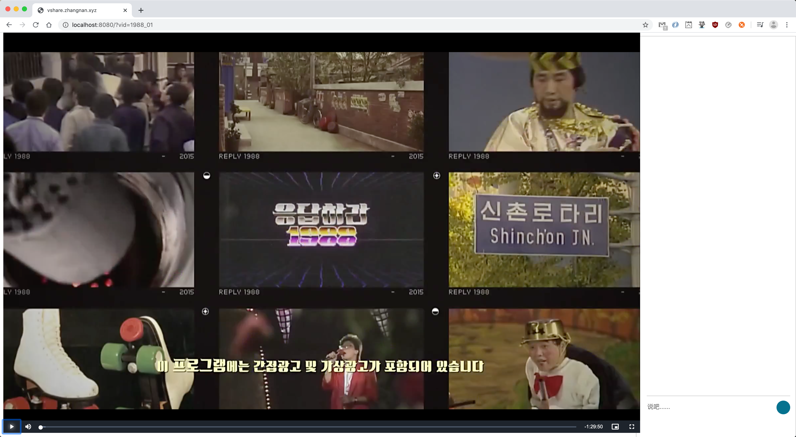

# vshare.zhangnan.xyz
视频分享/同步观看

- 配置视频，修改`build/config.json`
- 编译运行，`make docker`
- 浏览器访问，`http://localhost:8080/?vid=demovid`
- Reference
    - HLS标准，https://www.rfc-editor.org/pdfrfc/rfc8216.txt.pdf
- todo
    - m3u8视频片段缓存
    - 聊天交互功能

运行示例

